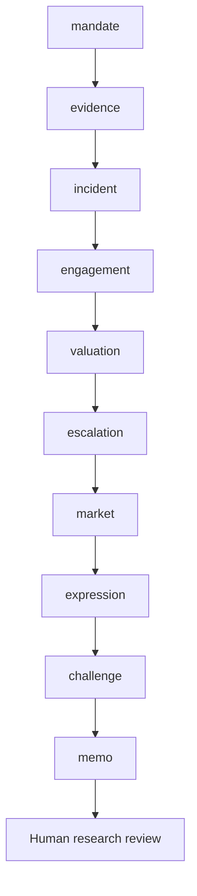

# Workflow

What is evidenced, what change is sought, how will progress be verified, and what investment or engagement review is warranted?

Routes: `engagement-plan`, `controversy-response`, `outcome-review`. These named use cases share a sequential evidence/review core; they are not separately calibrated financial models.

| Step | Research task | Stage ID |
|---|---|---|
| 1 | Mandate and investable decision | `mandate` |
| 2 | Evidence intake and reconciliation | `evidence` |
| 3 | Evidence and controversy chronology | `incident` |
| 4 | Engagement objectives and leverage | `engagement` |
| 5 | Progress and investment read-through | `valuation` |
| 6 | Escalation and stewardship accountability | `escalation` |
| 7 | Market context and implementation evidence | `market` |
| 8 | Investment-decision handoff | `expression` |
| 9 | Independent challenge and exceptions | `challenge` |
| 10 | Investment committee and accountable review | `memo` |

A COMPLETE artifact is structurally complete, not certified correct. Material gaps stop dependencies. Open MATERIAL/CRITICAL issues block research approval. A source-study intentionally stops after the evidence stage.
